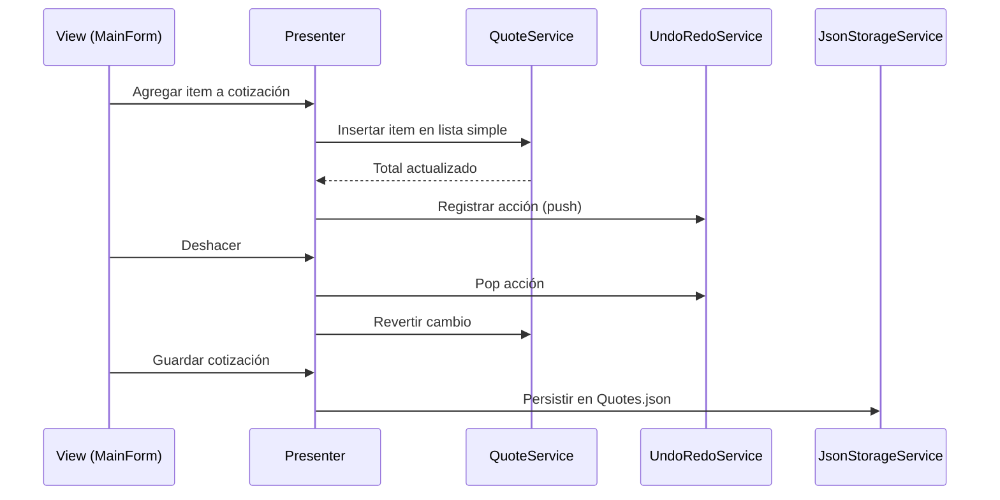
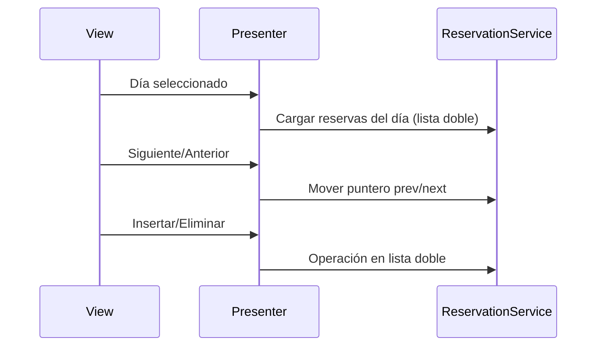
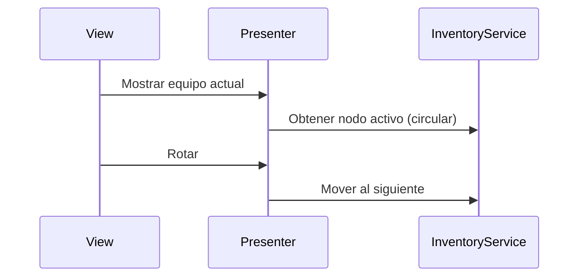
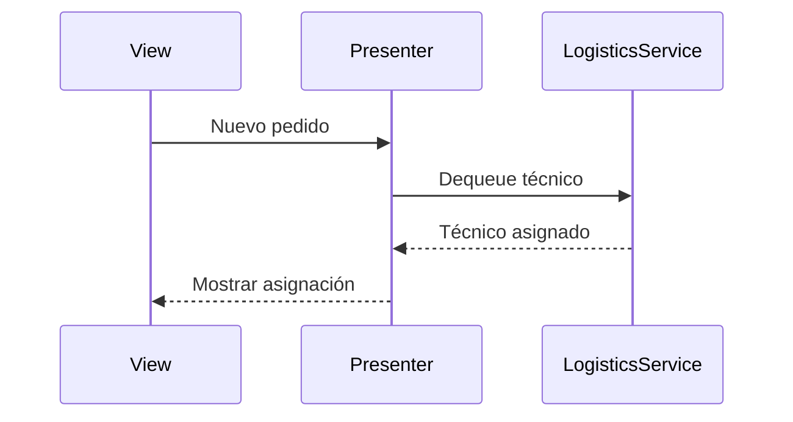
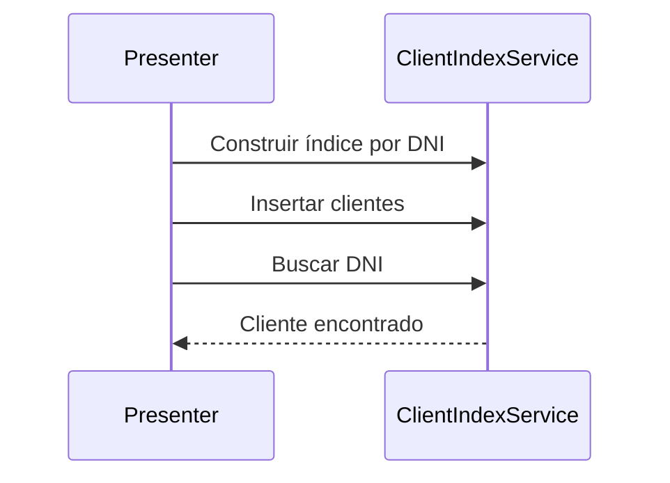
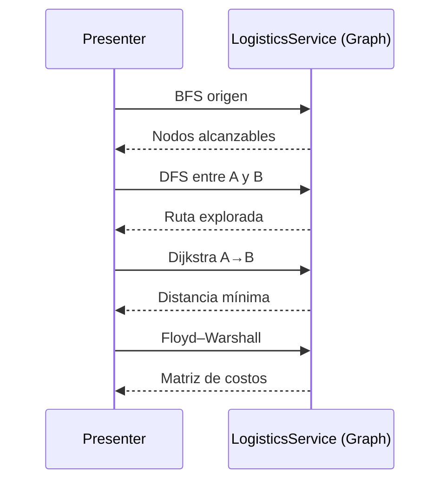
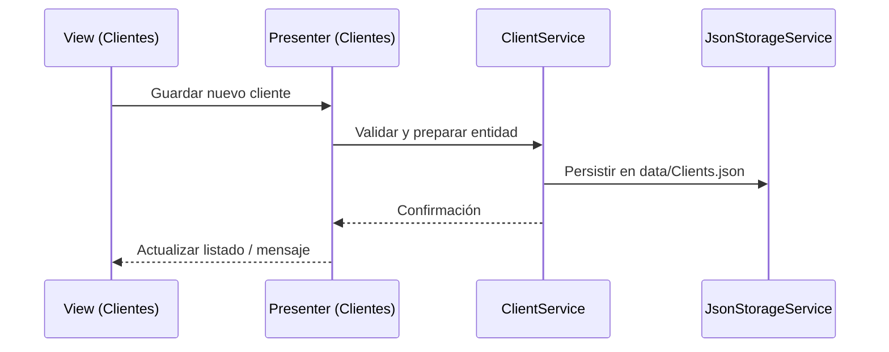

# Casos de uso y secuencias

Este documento describe los flujos principales del sistema y cómo cada estructura participa.

## Crear cotización (Lista simple + Pila)
- Flujo: seleccionar cliente → agregar items → calcular total → deshacer/rehacer → guardar.

## Calendario de reservas (Lista doble)
- Flujo: elegir día → navegar reservas prev/next → insertar/eliminar → ordenar por hora.

## Rotación de inventario (Lista circular)
- Flujo: iterar equipos disponibles → rotar al siguiente → marcar mantenimiento.

## Asignación de técnicos (Cola)
- Flujo: técnicos en espera → llegada de pedido → asignar FIFO → actualizar estado.

## Búsquedas de clientes/productos (ABB)
- Flujo: construir índice por clave → insertar elementos → búsquedas y recorridos.

## Rutas logísticas (Grafo)
- Flujo: verificar conectividad (BFS) → explorar rutas (DFS) → ruta más corta (Dijkstra) → matriz de costos (Floyd–Warshall).

## Alta de cliente (Clientes)
- Flujo: ingresar datos → validar → guardar en JSON → actualizar índices → confirmar.
