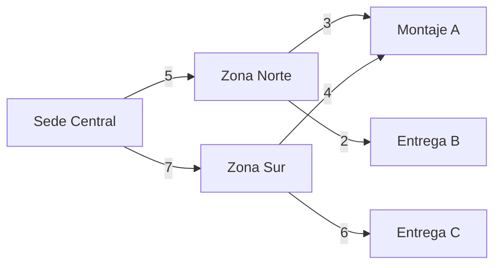

# Grafos: rutas y dependencias

## Mapa de rutas logísticas
- Nodos: sedes, zonas de entrega, puntos de montaje.
- Aristas: conexiones con peso (distancia/costo/tiempo).
- Uso:
  - BFS: ¿existe camino entre origen y destino?
  - DFS: explorar rutas posibles y detectar ciclos.
  - Dijkstra: ruta más corta con pesos no negativos.
  - Floyd–Warshall: matriz de costos para entregas múltiples.



## Dependencias paquete → productos
- Grafo dirigido donde un paquete depende de varios productos.
- Permite validar compatibilidades y detectar componentes faltantes.

```mermaid
graph TD
  P1[Paquete "Live Set"] --> Pr1[Controladora]
  P1 --> Pr2[Micrófono]
  P1 --> Pr3[Monitores]
  P2[Paquete "Estudio"] --> Pr4[Interfaz]
  P2 --> Pr5[Micrófono Condensador]
  P2 --> Pr6[Aislación]
```

## Interpretación de resultados
- BFS/DFS devuelven conjuntos/ordenes de visita para evaluar conectividad y alternativas.
- Dijkstra produce distancia mínima y predecesores para reconstruir la ruta.
- Floyd–Warshall entrega una matriz V×V con costos mínimos entre todas las parejas.

## Buenas prácticas
- Pesos coherentes: usar la misma unidad (p.ej., minutos o costo).
- Datos actualizados: reflejar obras, tráfico o mantenimientos.
- Validación de ciclos en dependencias de paquetes para evitar configuraciones inválidas.