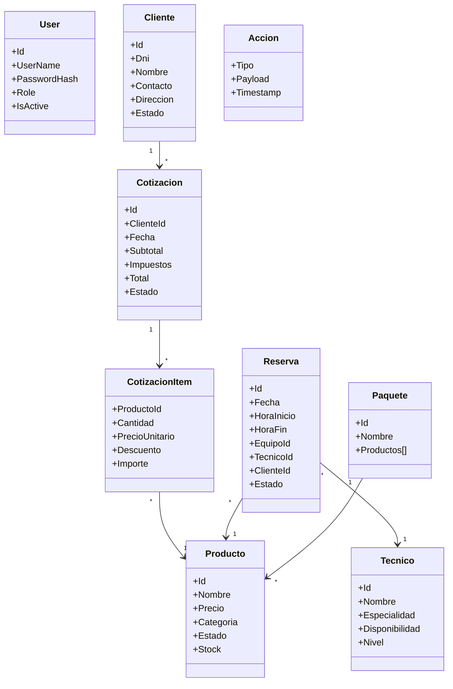

# Modelos del dominio (Productora 808xHz)

## Objetivo
Definir las entidades clave del sistema con sus campos, validaciones, relaciones e índices propuestos, alineados al uso de estructuras de datos y a los procesos reales del proyecto.

## User
- Propósito: autenticación y control de acceso.
- Campos: Id, UserName, PasswordHash, Role, IsActive.
- Validaciones: UserName único y no vacío; contraseña almacenada como hash; Role pertenece al conjunto permitido.
- Relaciones: usado por login y permisos en presenters/views.
- Índices: tabla hash por UserName para autenticación rápida.

## Cliente
- Propósito: entidad comercial que recibe cotizaciones y servicios.
- Campos: Id, Dni, Nombre, Contacto, Direccion, Estado.
- Validaciones: Dni único; Nombre y Contacto obligatorios; formatos válidos de email/teléfono.
- Relaciones: 1‑N con Cotizacion.
- Índices: ABB por Dni y por Nombre para búsqueda y ordenación.

## Producto
- Propósito: ítem del inventario y componentes de paquetes.
- Campos: Id, Nombre, Precio, Categoria, Estado (disponible/mantenimiento/reservado), Stock.
- Validaciones: Precio ≥ 0; Nombre único por categoría; coherencia de Estado con logística.
- Relaciones: aparece en CotizacionItem, Reserva y dependencias de paquetes.
- Índices: ABB por Id y por Nombre.

## Cotizacion
- Propósito: propuesta económica con detalle de productos/servicios.
- Campos: Id, ClienteId, Fecha, Items, Subtotal, Impuestos, Total, Estado (borrador/enviada/aceptada/rechazada).
- Validaciones: al menos un item; totales recalculados en cambios; ClienteId debe existir.
- Relaciones: 1‑N con CotizacionItem; vínculo a Cliente.
- Índices: por Id y rango de Fecha; filtros por Estado.

## CotizacionItem
- Propósito: detalle por producto dentro de una cotización.
- Campos: ProductoId, Cantidad, PrecioUnitario, Descuento (opcional), Importe.
- Validaciones: Cantidad ≥ 1; PrecioUnitario ≥ 0; Importe = (Cantidad × PrecioUnitario) − Descuento.
- Relaciones: referencia a Producto; agregado de Cotizacion.
- Índices: acceso mediante la Cotizacion.

## Reserva
- Propósito: planificación de uso de recursos/equipos por fecha y hora.
- Campos: Id, Fecha, HoraInicio, HoraFin, EquipoId (Producto), TecnicoId (opcional), ClienteId (opcional), Estado (pendiente/confirmada/cancelada).
- Validaciones: HoraFin > HoraInicio; evitar solapamientos para el mismo equipo; estados consistentes.
- Relaciones: vincula Producto, opcionalmente Técnico y Cliente.
- Índices: por Fecha/Hora; recorrido con lista doble por día.

## Tecnico
- Propósito: asignación de personal a pedidos y montajes.
- Campos: Id, Nombre, Especialidad, Disponibilidad (disponible/ocupado), Nivel (opcional).
- Validaciones: Nombre y Especialidad obligatorios; Disponibilidad coherente con asignaciones.
- Relaciones: puede asociarse a Reserva y tareas de logística.
- Índices: cola FIFO para asignación; búsqueda por Especialidad.

## Accion
- Propósito: registro de operaciones para Undo/Redo en cotizaciones.
- Campos: Tipo (agregar/eliminar/editar), Payload (datos mínimos), Timestamp.
- Validaciones: Tipo permitido; Payload suficiente para recomponer estado.
- Relaciones: utilizada por servicio de Undo/Redo.
- Índices: no requiere; manejo con pila LIFO.

## Paquete
- Propósito: agrupación de productos con dependencias.
- Campos: Id, Nombre, Productos[], Notas (opcional).
- Validaciones: consistencia de productos; evitar dependencias cíclicas.
- Relaciones: grafo dirigido Paquete → Producto (dependencias y compatibilidades).
- Índices: búsqueda por Nombre; validaciones de dependencia con grafo.

## Relaciones principales
- Cliente ↔ Cotizacion (1 a N).
- Cotizacion ↔ CotizacionItem (1 a N).
- CotizacionItem ↔ Producto (N a 1).
- Reserva ↔ Producto/Tecnico (N a 1 por cada vínculo).
- Paquete ↔ Producto (N a N vía grafo dirigido).

## Integración con estructuras
- Cotizacion: lista simple para Items (insertar, eliminar, recorrer, ordenar, buscar, mezclar).
- Reserva (por día): lista doble para navegación prev/next y orden por hora.
- Inventario: lista circular para rotación continua de equipos.
- Accion: pila para Undo/Redo.
- Tecnico: cola FIFO para asignación de logística.
- Cliente/Producto: ABB para índices y búsquedas rápidas.
- Rutas y paquetes: grafo para conectividad, exploración y costos.

## Diagrama conceptual de modelos

## Referencias a gráficos
- Diagrama detallado en `Docs/uml/models-details.mmd` para impresión/exportación.