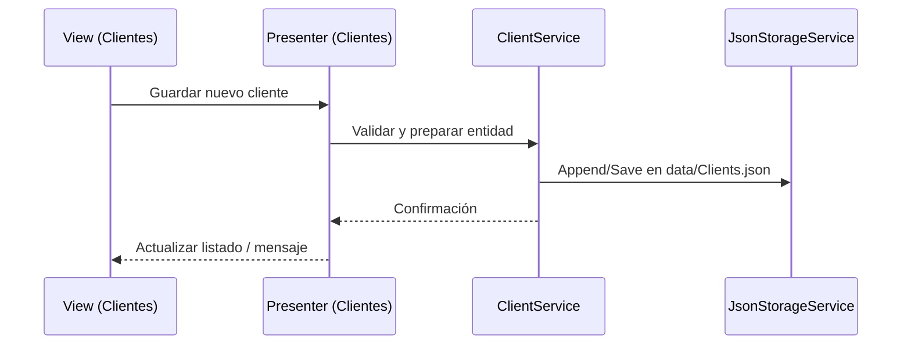

# Gestión de clientes: alta, edición y búsqueda

## Objetivo
Explicar dónde y cómo se agrega un cliente en el sistema, su persistencia en JSON y la integración con estructuras de datos para búsquedas y reportes.

## ¿Dónde se agrega el cliente?
- Vista dedicada en el `MainForm`: sección "Clientes" con formulario de alta y listado.
- Acceso desde el menú/pestañas del dashboard.
- Formulario de alta incluye: Dni, Nombre, Contacto (tel/email), Direccion, Estado.

## Flujo de alta de cliente
- El usuario completa el formulario y confirma.
- El presenter valida datos y solicita al servicio persistir en `data/Clients.json`.
- Se actualizan índices en memoria para búsquedas (ABB por Dni/Nombre).

## Persistencia
- Archivo: `data/Clients.json`.
- Estructura: lista de clientes con campos definidos en el modelo.
- Validación: Dni único; campos obligatorios; formatos correctos.
- Estrategia: lectura, modificación en memoria y escritura con `JsonStorageService`.

## Búsqueda e índices
- Índices en ABB:
  - Clave por `Dni` para búsquedas exactas.
  - Clave por `Nombre` para ordenación y autocompletado.
- Recorridos: inorden para listados ordenados; búsqueda para acceso directo.

## Integración con otros módulos
- `QuoteService`: selección de cliente al crear una cotización.
- `LogisticsService`: referencia a `Cliente` en reservas o entregas según aplique.
- Reportes: listados por estado, rango de fechas y búsquedas por `Dni`/`Nombre`.

## Reglas y validaciones
- Dni debe ser único y no vacío.
- Nombre y Contacto obligatorios; correo/teléfono con formato válido.
- Estado en conjunto permitido: activo/inactivo.

## Consideraciones de UI
- Listado con filtros por `Nombre` y `Estado`.
- Botones: "Agregar", "Editar", "Eliminar" con confirmaciones.
- Mensajes claros de validación y éxito.

## Referencias
- Persistencia: `services/JsonStorageService.cs`.
- Arquitectura y datos: `Docs/01-Arquitectura.md` (mapa de módulos y `Clients.json`).